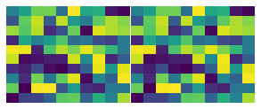

```python
import numpy as np
import matplotlib.pyplot as plt
%matplotlib inline
```
```python
fig, axs = plt.subplots(nrows=1, ncols=2, figsize=(5, 2))
axs = axs.reshape(1,2)

for ax in fig.axes:
    ax.set_xticklabels([])
    ax.set_yticklabels([])
    ax.set_axis_off()
        
img = np.random.rand(10, 10)

axs[0,0].imshow(img, aspect='auto')
axs[0,1].imshow(img, aspect='auto')

fig.subplots_adjust(wspace=0.01, hspace=0.01)
plt.savefig('tmp.svg', format='svg', bbox_inches = 'tight', pad_inches = 0)
```


